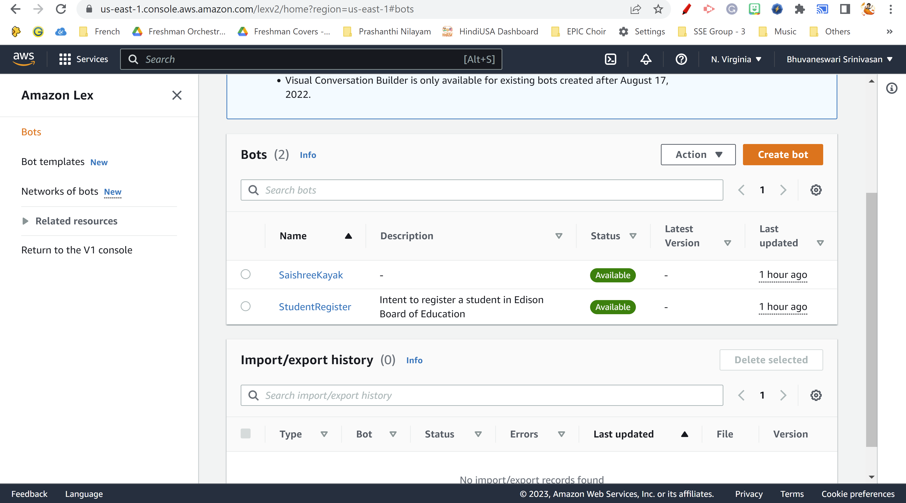
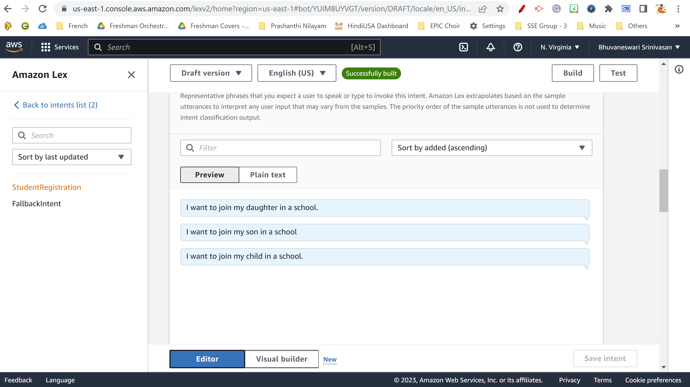
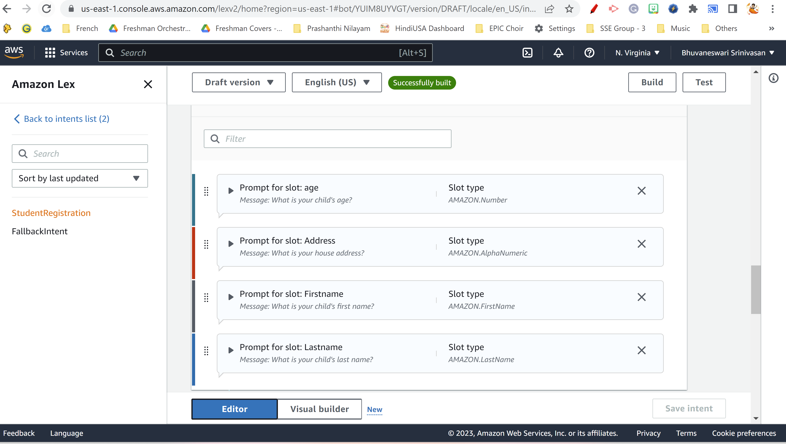
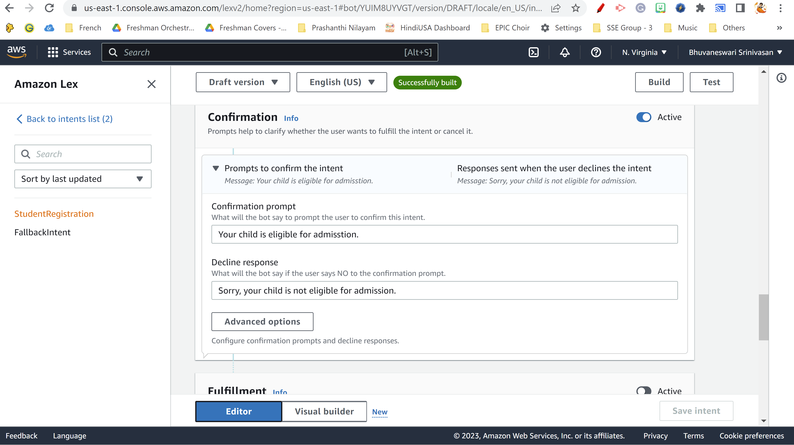
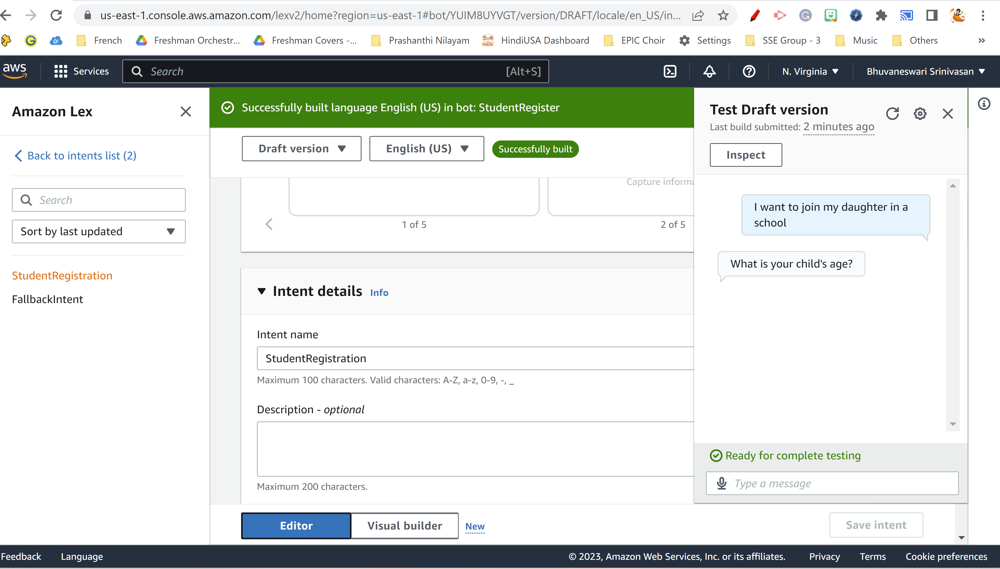
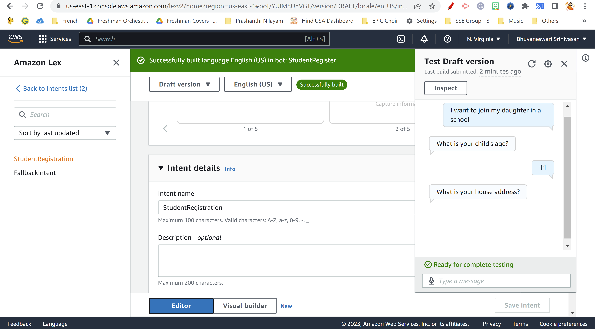
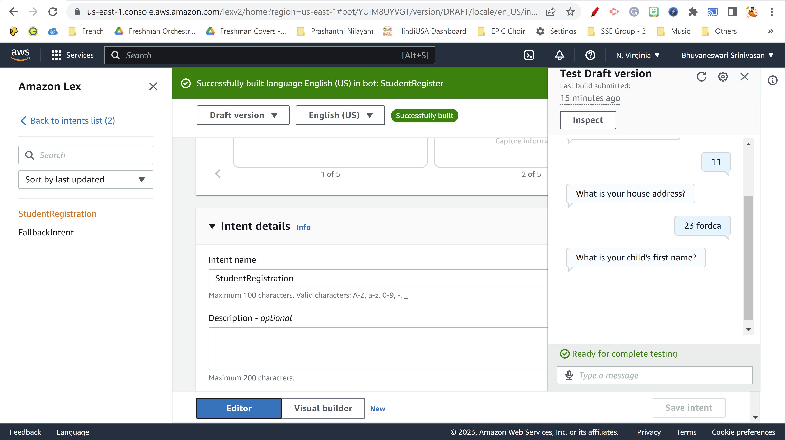
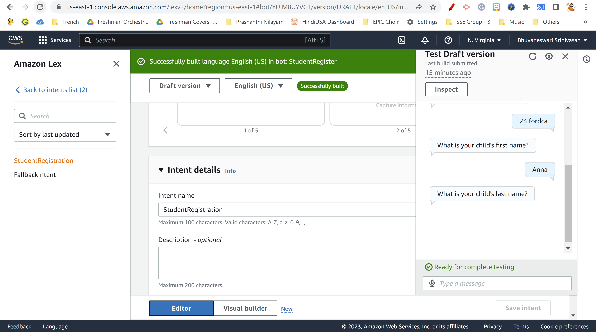

# GWCSpringHumanizeAIChallenge2023-EdiBBot
A Chat bot for registering a student
# Project Name
A chat bot for AI to register a student and this may be used by the Edison Board of Education.
# Technology
Amazon Web Services (AWS): Lex
AWS is a service fro building conversational applications using voice and/or text.
# Steps to create Chat Bot
## Step 1:
 Create an account in AWS using console.
## Step 2: 
Create a bot using AWS Lex

## Step 3: 
Configure Intent.

## Step 4: 
Configure Utterances/slot.

## Step 5: 
Built the Bot
## Step 6: 
Test using Sample Chat Bot.

